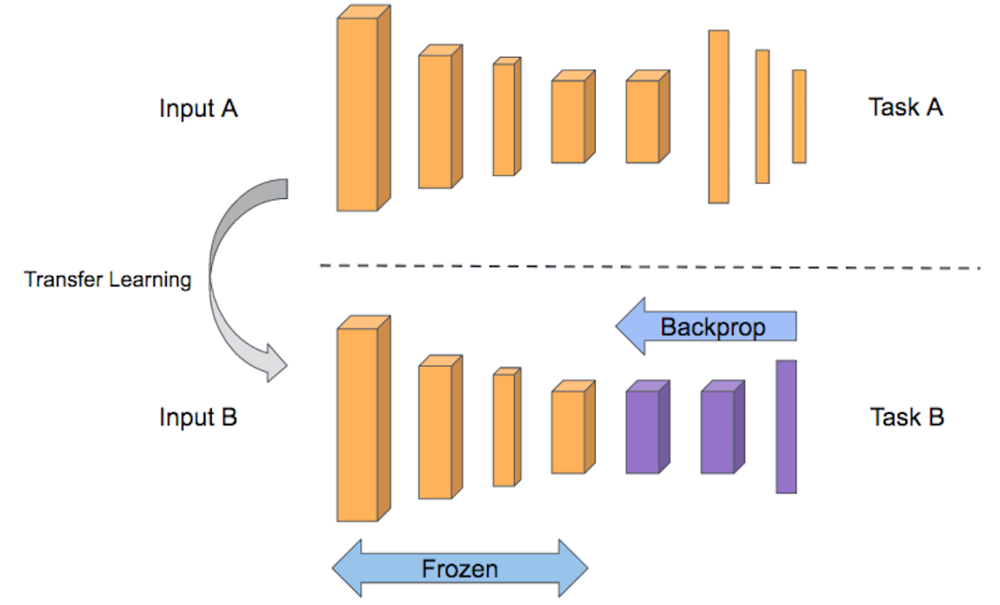

# Transfer learning and Fine Tuning

In this report, we will address an image classification problem using two deep learning techniques.   

At first, I will train a CNN from scratch with our dataset and then, I will use transfer learning and fine-tuning using a pre-trained model to solve our deep learning problem. Intuitively, the two approaches employ different resources and processing times, since the latter has already been formed on a large amount of data. We'll see if, in addition to time and resources, the transfer learning approach also allows for greater network reliability.  
For more details on implementation and functionality, you can view the [report.](https://drive.google.com/file/d/1ppvAZmk5gXKOSkQws25gFJnWYPsvZFaX/view?usp=sharing) 
